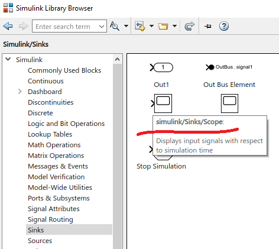
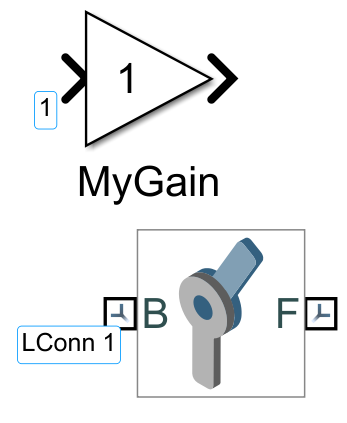
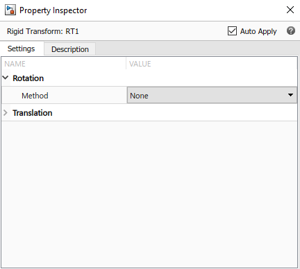
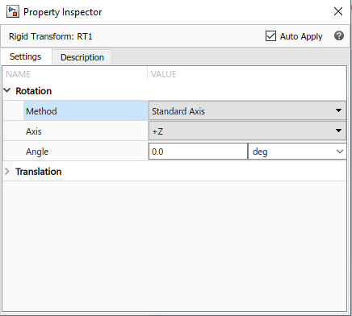
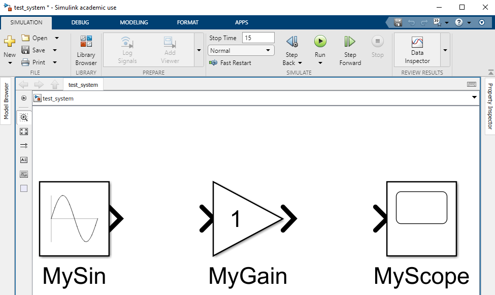
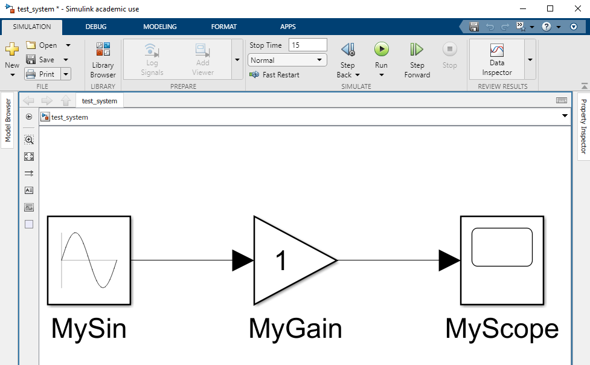
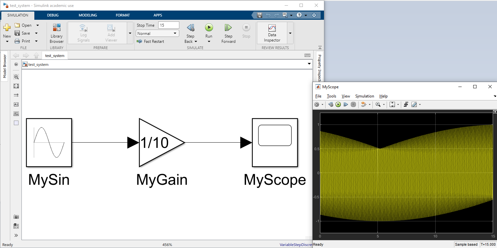

# Simulink Model generation using MATLAB Commands and Functions  
The main task of this example is to create and fill in a .slx file using the MATLAB script. MATLAB has an extensive API (Application Program Interface) for building and modifying Simulink models from MATLAB code. This may be from either the MATLAB command line, from within a function or script, or from anywhere that m-code can be executed.  
*Required version of MATLAB 2021b and higher (italic)*  
  
The primary functions for this:  
+ `add_block`  
+ `add_line`  
+ `set_param` 
+ `get_param`     
  
## Helpful Tips  
1. To determine the source path of the placed block, you need to open the Simulink Library Browser, find the required block, move the mouse cursor:  
  
  
2. To determine the name of the ports, you need to find it in the model and hover over the port icon:  
  
  
3. To set block parameters, you need to know the exact names of the fields. You can get information about all fields of the block with the command:  
```MATLAB
>> get_param([fname,'/MyGain'], 'ObjectParameters')

ans = 

  struct with fields:

                                        Name: [1×1 struct]
                                         Tag: [1×1 struct]
                                 Description: [1×1 struct]
                                        Type: [1×1 struct]
                                      Parent: [1×1 struct]
                                      Handle: [1×1 struct]
                             HiliteAncestors: [1×1 struct]
                             RequirementInfo: [1×1 struct]
                                       Ports: [1×1 struct]
                                    Position: [1×1 struct]
                                    ...
                                    ...
```  
Before using `get_param` the model must first be loaded into memory. This can be achieved by either opening the model manually or by using either of the the API functions `load_system` or `open_system`. View the value of a target field:  
```MATLAB
>> get_param([fname,'/MyGain'], 'Gain')

ans =

    '1'
```  
You can find out what values can be assigned to the field by manually setting the block parameters:  
Step 1: View field value  
```MATLAB
>> get_param([fname,'/RT1'], 'RotationMethod')

ans =

    'None'
```  
Step 2:Change block settings manually  
   
  
Step3: Check new field value  
```MATLAB
>> get_param([fname,'/RT1'], 'RotationMethod')

ans =

    'StandardAxis'
```

## Sine Wave Model  
To run the example use `just_sin_wave.m`. The script checks for the existence of the `test_system.slx` file. The file is then recreated. Each script startup overwrites the Simulink model `test_system.slx`. The script will add new blocks to the scheme space:  
  
  
  
After that, the script adds links between the blocks:  
  
  
  
Block parameters are changed and simulation is started. To close the model, you must press the Enter key in the Matlab console. The result of the script:  
  
   
  
## 2 Bar Mechanism  
To run the example use `two_bar_mech.m`. The script generates a two-link mechanism using Simscape Blocks. The model building algorithm is similar to the example with a sinusoidal signal. The model is supplemented with a connection to the workspaces of MATLAB to obtain a signal that sets the movement. Approbation of the operation of the mechanism model is carried out on the movement of the working body along a circular trajectory.
  
